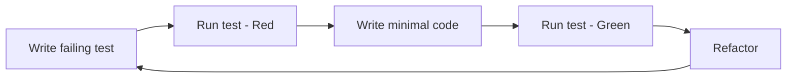

# User Manual

Welcome to **kata-projects** — a curated collection of 49 code katas for deliberate programming practice.

## Table of Contents

1. [Quick Start](#quick-start)
2. [Choosing a Kata](#choosing-a-kata)
3. [TDD Workflow](#tdd-workflow)
4. [Language Setup](#language-setup)
5. [Collections Overview](#collections-overview)
6. [Contributing](#contributing)

---

## Quick Start

```bash
# Clone and enter
cd kata-projects

# Install Python tooling (uv)
uv sync

# Run catalog verification
uv run pytest tests/

# Pick a kata and start coding!
cd dave-thomas-codekata/kata02-karate-chop
# Edit kata02_karate_chop.py and test_kata02_karate_chop.py
uv run pytest test_kata02_karate_chop.py -v
```

---

## Choosing a Kata

### By Collection

| Collection | Focus | Best For |
|------------|-------|----------|
| **Dave Thomas CodeKata** | Algorithms, modeling, design | General practice, system design |
| **Gaurav Arora TDD Katas** | Classic TDD exercises | Learning TDD, refactoring |
| **Wonderland Clojure Katas** | Puzzles, word games, math | Fun, algorithmic thinking |
| **SensioLabs PoleDev Katas** | Forms, events, uploads, i18n | Web/app development patterns |

### By Difficulty (Subjective)

| Level | Katas |
|-------|-------|
| **Beginner** | FizzBuzz, OddEven, Leap Year, String Sum, String Calculator |
| **Intermediate** | Karate Chop, Prime Factors, Anagrams, Word Chains, Magic Square |
| **Advanced** | Bowling Game, Game of Life, Harry Potter, Poker Hands, Reversi, Klondike |

### By Topic

| Topic | Katas |
|-------|-------|
| **Algorithms** | Karate Chop, Sorting, Word Chains, Transitive Dependencies, Bloom Filters |
| **Data Structures** | Linked Lists, Anagrams, Best Sellers (heap), Mine Fields (grid) |
| **TDD Classics** | String Calculator, Bowling Game, Prime Factors, FizzBuzz |
| **Game Logic** | Bowling, Game of Life, Reversi, Yahtzee, Klondike, War |
| **Parsing/Processing** | Data Munging, Code Lines, Word Wrap, File Upload |
| **Design/Patterns** | Business Rules, Hashes vs Classes, Checkout, Forms |

---

## TDD Workflow

This repository follows **Test-Driven Development** as the primary practice method.

### The TDD Cycle



### Step-by-Step

1. **Read the kata README** — Understand the problem, examples, TDD steps
2. **Open the test file** — `test_<name>.py` has placeholder tests
3. **Write one failing test** — Start with the first TDD step from README
4. **Run the test** — `uv run pytest test_<name>.py::TestClass::test_method -v`
5. **Make it pass** — Write minimal implementation in `<name>.py`
6. **Refactor** — Clean up, apply DDD/CQRS patterns
7. **Repeat** — Next TDD step

### Example: Karate Chop (kata02)

```bash
cd dave-thomas-codekata/kata02-karate-chop

# 1. Read README.md for TDD steps
# 2. Edit test file - first test: empty array
# 3. Run: uv run pytest test_kata02_karate_chop.py::TestKarateChop::test_basic_case -v
# 4. Implement chop() in kata02_karate_chop.py
# 5. Repeat for: single element, two elements, etc.
```

### Test Organization

Each test file has three test methods:

| Method | Purpose |
|--------|---------|
| `test_basic_case` | Core examples from README |
| `test_edge_cases` | Empty input, boundaries, invalid input |
| `test_tdd_progression` | Follow the exact TDD steps from README |

---

## Language Setup

### Python (Primary)

```bash
# Already configured with uv
uv sync          # Install dependencies
uv run pytest    # Run tests
uv run ruff check .    # Lint
uv run mypy .    # Type check
```

**Dependencies** (in `pyproject.toml`):
- `pytest` — Testing
- `pytest-cov` — Coverage
- `ruff` — Fast linting
- `mypy` — Type checking

### Other Languages

Each kata is language-agnostic. For other languages:

| Language | Setup |
|----------|-------|
| **TypeScript** | `npm init -y && npm i -D vitest typescript` |
| **Go** | `go mod init kata && go test ./...` |
| **Rust** | `cargo new --lib kata && cargo test` |
| **Java** | Use Maven/Gradle with JUnit |
| **C#** | `dotnet new classlib && dotnet test` |

**No templates provided** — katas are designed to be implemented from scratch in any language.

---

## Collections Overview

### Dave Thomas CodeKata (21 katas)

Source: [codekata.com](http://codekata.com)

| # | Kata | Type |
|---|------|------|
| 01 | Supermarket Pricing | Design (no code) |
| 02 | Karate Chop | Algorithm (5 implementations) |
| 03 | How Big? How Fast? | Estimation |
| 04 | Data Munging | File parsing + DRY |
| 05 | Bloom Filters | Probabilistic DS |
| 06 | Anagrams | Dictionary grouping (implemented) |
| 07 | How'd I Do? | Quiz scoring (implemented) |
| 08 | Conflicting Objectives | Tradeoff analysis (implemented) |
| 09 | Back to the Checkout | Checkout system |
| 10 | Hashes vs Classes | Data vs behavior |
| 11 | Sorting It Out | 8 sorting algorithms |
| 12 | Best Sellers | Top-K streaming |
| 13 | Counting Code Lines | LOC tool |
| 14 | Tom Swifties | Pun generation |
| 15 | A Diversion | Open-ended |
| 16 | Business Rules | Rules engine |
| 17 | More Business Rules | Advanced rules |
| 18 | Transitive Dependencies | Dependency graph |
| 19 | Word Chains | Word ladders |
| 20 | Klondike | Solitaire game |
| 21 | Simple Lists | Linked list DS |

### Gaurav Arora TDD Katas (16 katas)

Source: [TDD-Katas](https://github.com/garora/TDD-Katas)

Classic TDD exercises from Roy Osherove, Uncle Bob, and others.

### Wonderland Clojure Katas (7 katas)

Source: [wonderland-clojure-katas](https://github.com/gigasquid/wonderland-clojure-katas)

Lewis Carroll-themed puzzles.

### SensioLabs PoleDev Katas (5 katas)

Source: [devdrops/Katas](https://github.com/devdrops/Katas)

Symfony/form-focused exercises.

---

## Contributing

See [CONTRIBUTING.md](../CONTRIBUTING.md) for the contribution workflow.

### Adding a New Kata

1. Create directory under appropriate collection
2. Add `README.md` with problem, requirements, examples, TDD steps
3. Run generator: `python3.12 generate_templates.py`
4. Verify: `uv run pytest tests/`
5. Update `ROADMAP.md` if new collection

### Implementation Guidelines

Follow the **Implementation Preferences** in `AGENTS.md`:
- Domain-Driven Design (entities, value objects, aggregates, domain services)
- CQRS (separate commands and queries)
- Repository pattern (abstract data access)
- In-memory state only (no DB, no ORM)

---

## Getting Help

- **Kata-specific**: Read the kata's `README.md` first
- **TDD process**: Follow the TDD steps in each README
- **Architecture**: See [`/architecture`](../architecture/README.md) for internal design
- **Governance**: See [`AGENTS.md`](../AGENTS.md) for project rules